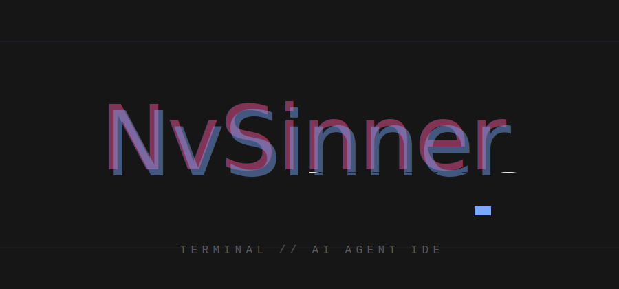

<p align="center">
  
</p>

<div align="center">

**A Neovim distribution that turns the terminal into a Cursor-like AI IDE — no in-editor AI plugin, just your favorite CLI agent in a live, activity-aware column.**


[Features](#-features) • [Getting started](#-getting-started) • [The AI workflow](#-the-ai-workflow) • [Settings](#-settings--theming) • [Keybindings](#-full-keybindings-reference) • [Updating](#-updating)

</div>

> *"I got tired of so many IDEs and code editors everywhere — they all end up
> forcing you to use the mouse. On top of that, I started seeing AI tools
> running in the terminal via CLI. That was it for me. Let's put everything
> in the terminal and call it done."*
> — Ander

NvSinner is a Neovim config managed with **lazy.nvim**, packaged as an
installable distro with a native **carbon** theme (a self-contained
oxocarbon / IBM Carbon port — industrial grays, blue-forward accents). It
installs under its own `NVIM_APPNAME=nvsinner`, so it runs side-by-side with
any existing `~/.config/nvim` without touching it.

## ✨ Features

- **AI as a terminal column, not a plugin** — run any CLI agent (`claude`,
  `kiro-cli`, `opencode`, …) in up to 9 persistent vertical columns
  (`<leader>j`, `<leader>j2`…`j9`). The first open shows a picker asking which
  CLI to launch; the CLI handles its own auth, no API key touches the config.
- **Send-to-AI bridge** — pipe editor context straight into the AI column
  without touching the clipboard: `<leader>as` sends the visual selection,
  `<leader>ab` an `@path` mention, `<leader>ad` the current line's
  diagnostics. Text lands in the CLI's input as one editable block — never
  auto-submitted.
- **Ask AI modal** — select code and hit `<leader>x` (or just **double-click
  a word**) for the IDE-style quick-action menu: **Fix / Refactor / Explain /
  Ask custom question**. The chosen prompt (with the file path and line
  range) plus the selection lands in the AI column's input; with more than
  one session open, a picker asks which one.
- **AI edit highlights** — when the agent rewrites an open file, the changed
  lines get a soft wash of your accent color right in the file pane (distinct
  from git's gutter marks) and clear the moment you take the file over.
- **Live agent activity** — every terminal carries a winbar with a session
  label and a native busy/idle spinner (`⠹ working…` / `● idle`), plus an
  opportunistic `◆ needs input` state when the program signals a prompt via
  OSC sequences (shell integration / notifying CLIs). The statusline shows a
  cockpit badge (`AI: 2 working · 1 idle`) across all sessions, and
  `<leader>ja` opens a picker that jumps to any session.
- **Disk-wins auto-reload** — when the agent edits a file, the open buffer
  reloads automatically and a `🤖 AI · edited <file>` toast names it.
- **Prompt library** — `<leader>p` opens a modal of eleven reusable AI
  prompts (plain JSON, hand-editable) and copies your pick to the OS
  clipboard.
- **Mason-style modals** — `:NvSinnerMenu` (settings, persisted),
  `:NvSinnerPrompts`, and `:NvSinnerHelp` (a command palette that runs what
  you pick), all keyboard- and mouse-driven.
- **Carbon theme, configurable in one place** — dark/light variants,
  transparency, four accent packs, and per-role color slots, all from a
  single palette file (`lua/core/carbon.lua`) — live-applied and persisted.
- **Native-first** — focus glow, mouse-hover docs, agent activity, the
  send-to-AI bridge, health checks, and the updater are zero-dependency core
  modules, not plugins.
- **Distro table stakes** — Trouble diagnostics panel (`<leader>x*`), LSP
  rename (`<leader>rn`) alongside the Neovim 0.11 builtins, Telescope pickers
  for diagnostics/keymaps/commands/resume (`<leader>s*`), which-key group
  labels, and LSP servers for TypeScript, Lua, HTML/CSS/JSON/YAML, Python and
  Bash out of the box (Go/Rust/Ruby light up when their toolchains exist).
- **Fast** — almost everything is lazy-loaded; headless cold start ≈ 40 ms
  (median of 3, measured 2026-07-03). Check yours with `:Lazy profile`.
- **Reproducible** — plugins are pinned in a committed `lazy-lock.json`;
  installs and updates `restore` to the tested set instead of floating to
  latest. A plenary test suite covers the core behavior (`make test`).

## 📦 Requirements

| Tool | Used by |
|------|---------|
| Neovim **0.11+** | native `vim.lsp` API, `vim.uv` |
| `git` | lazy.nvim plugin fetch |
| `ripgrep` | Telescope live grep |
| `node` | `prettier` / `eslint_d` |
| A **Nerd Font** | icons (FiraCode Nerd Font is bundled in `fonts/`) |
| `eslint_d`, `prettier`, `stylua`, `shfmt` | none-ls formatting/linting (auto-installed via Mason on first boot) |
| an AI CLI, e.g. `claude` | AI terminal column (optional) |

> [!IMPORTANT]
> Neovim **0.11+** is a hard requirement — the config uses `vim.uv` and the
> native `vim.lsp.config` / `vim.lsp.enable` API and will not load on older
> versions. Verify with `nvim --version | head -1`.

The AI workflow is just a CLI agent run in the terminal column — install one
(e.g. `npm i -g @anthropic-ai/claude-code`) and run it once to log in. No
`ANTHROPIC_API_KEY` needed by the config; the CLI handles its own auth.

## 🚀 Getting started

### One-liner

```bash
curl -fsSL https://raw.githubusercontent.com/anderssonq/nvsinner/main/install.sh | bash
```

Clones NvSinner into `~/.config/nvsinner`, installs a `nvsinner` launcher into
`~/.local/bin`, and bootstraps every plugin. Then just run:

```bash
nvsinner
```

### Manual

```bash
git clone https://github.com/anderssonq/nvsinner.git ~/.config/nvsinner
NVIM_APPNAME=nvsinner nvim     # lazy.nvim bootstraps + installs on first launch
```

> [!NOTE]
> `NVIM_APPNAME=nvsinner` gives the distro its own config/data/state/cache
> dirs, so it never collides with another Neovim setup — your existing
> `~/.config/nvim` is untouched.

LSP servers (`lua_ls`, `ts_ls`, `html`, `pyright`, `bashls`, `jsonls`,
`yamlls`, `cssls`) and the formatting/linting tools (`stylua`, `prettier`,
`eslint_d`, `shfmt`) auto-install via Mason on first launch — no
manual `:MasonInstall` or `npm i -g` needed. On the first interactive launch a
one-time toast points at `:checkhealth nvsinner` if any external tool is
missing. Verify anytime with `:Lazy` and `:checkhealth`.

## 🤖 The AI workflow

There are no in-editor AI plugins. AI is a **CLI agent run in the terminal
column**: press `<leader>j` to open it. The first time a session opens, a
picker appears in the column's own space asking which CLI to launch —
`claude`, `kiro-cli`, `opencode` (uninstalled ones are marked), or **plain
terminal — no AI**, which starts your shell and titles the column `term` like
the horizontal terminals. Navigate with `j`/`k`, launch with `Enter` (or
click a row), cancel with `q`. Sessions 2–9 (`<leader>j2`…`<leader>j9`) are
independent columns, each with its own agent. The column's side (left/right)
is configurable in `:NvSinnerMenu`.

Every terminal's top bar shows a **session label and activity spinner**
(`AI · 1 ⠹ working…` / `● idle`) driven by actual output, so a glance tells
you whether an agent — or a long build in a `<leader>t` terminal — is still
going. When the program signals a prompt (OSC 133 shell integration, or a
terminal notification), the bar flips to `◆ needs input` — this only works
for programs that emit those sequences; the output-based spinner covers
everything else. The statusline adds a cockpit badge (`AI: 2 working ·
1 idle`) summarizing every session, and `<leader>ja` opens a picker that
jumps to (or reopens) any of them.

**Send context without the clipboard:** select code and hit `<leader>as` to
drop it into the AI column's input, `<leader>ab` to send an `@path` mention
of the current file, `<leader>ad` to send the current line's diagnostics.
Multi-line text arrives as one editable block (bracketed paste) and is never
auto-submitted — you review and press Enter. With no session open yet, the
bridge opens session 1 and asks you to resend.

**Ask AI about a selection:** select code and hit `<leader>x` to open the
Ask-AI modal — **Fix**, **Refactor**, **Explain**, or **Ask custom question**
(typed in a small input). The action becomes a prompt header carrying the
file's path and line range (`Fix this code in lua/core/foo.lua:10-25:`),
followed by the selected code, and lands in the AI column's input like every
other bridge send. With more than one AI session registered, a picker asks
which session to send to. `:NvSinnerAskAI` reruns it on the last selection,
and **double-clicking a word** in a code pane opens the same modal over that
word (an active visual selection is used instead when there is one; special
panes like the tree and terminals are left alone).

> [!WARNING]
> Auto-reload is **disk-wins** by design: when the AI CLI edits a file on
> disk, the buffer reloads and unsaved in-editor edits to that buffer are
> discarded. It's built for the viewer-style workflow — you edit through the
> AI pane, the editor is the cockpit. Each reload fires a `🤖 AI · edited
> <file>` toast so nothing changes silently.

After each reload, the lines the agent changed get a **soft background wash
in your accent color** (the one picked in `:NvSinnerMenu`, blended into the
editor background like a tinted cursor-line so the code stays readable) right
in the file pane — you see at a glance what the AI just touched while you're
still reading its summary in the column. The marks clear as soon as you take
over the file — move the cursor in it or start editing. For a persistent,
reviewable diff use `<leader>gd` (Diffview) as usual.

### `:NvSinnerPrompts` — the prompt library

Press `<leader>p` (or run `:NvSinnerPrompts`) to open a floating library of
reusable AI prompts — eleven ship as defaults: PR description, strict code
review, feature plan, bug fix, tests-from-pattern, commit message, refactor,
explain code, docstrings, security review, and git conflict resolution.
Picking one **copies the full prompt to the OS clipboard**, ready to paste
into the AI column's CLI (then fill in the `[PLACEHOLDERS]`). Digits `1`–`9`
jump to the first nine; reach the rest with `j`/`k` or the mouse.

> [!TIP]
> The library is plain JSON at `settings/prompts.json`: press `e` inside the
> modal to open it and add or edit prompts (`content` can be a string or an
> array of lines; the file is re-read on every open, so no restart needed).

### `:NvSinnerHelp` — the command palette

Can't remember a command? `:NvSinnerHelp` lists every NvSinner command
(`:NvSinnerMenu`, `:NvSinnerPrompts`, `:NvSinnerUpdate`, `:NvSinnerSync`,
`:checkhealth nvsinner`, …) with a one-line description. Press `Enter` — or
click a row — to **run it**; the palette closes itself. New commands are
discovered automatically, so the list is never stale.

## 🎨 Settings & theming

### `:NvSinnerMenu` — the settings modal

The easiest way to configure the theme (and a few layout choices) is
**`:NvSinnerMenu`**: a Mason-style floating panel where every change applies
live and persists across restarts (stored as JSON in the distro's `settings/`
folder). Navigate with `j`/`k`, change a value with `h`/`l` (or
`Enter`/`Space`), jump with `1`–`9`, close with `q` — or use the mouse:
hovering moves the selection and a click cycles the row's value.

| Row | Values |
|-----|--------|
| Background theme | `carbon` (dark, default) / `moon` (light) / `onedusk` / `mocha` / `kyoto` / `fjord` / `monolith` — original palettes inspired by One Dark Pro, Catppuccin Mocha, Tokyo Night, Nord and Monokai |
| Transparency | `off` / `on` |
| Accent | `blue` / `magenta` / `green` / `purple` — swaps only the identity text accent, never the gray surfaces |
| Folder color | `accent` / `teal` / `aqua` / `pink` / `green` / `purple` / `gray` — recolors Neo-tree's folder names + icons |
| Notif color | `default` / `accent` / `teal` / `aqua` / `magenta` / `pink` / `green` / `purple` / `plain` — recolors info toasts (warnings/errors keep their semantic colors) |
| Variables | same choices — recolors syntax variables, parameters and fields |
| Strings | same choices — recolors syntax strings |
| Functions | same choices — paints the whole function/method family in one accent |
| Neo-tree side | `left` / `right` |
| AI column side | `left` / `right` |
| Notifications | `shown` / `hidden` (hides info toasts; warnings/errors still show) |

### Theme options (carbon)

The theme flags can also be set per launch via an environment variable, or
with a `vim.g` global early in `lua/core/options.lua`. Precedence: `vim.g`
wins over the environment, which wins over the persisted `:NvSinnerMenu`
value:

| Flag | Values | Per launch | Persistent |
|------|--------|-----------|------------|
| Background theme | `carbon` (default) / `moon` / `onedusk` / `mocha` / `kyoto` / `fjord` / `monolith` | `NVSINNER_THEME=fjord nvsinner` | `vim.g.nvsinner_theme = "fjord"` |
| Transparency | off (default) / on | `NVSINNER_TRANSPARENT=1 nvsinner` | `vim.g.nvsinner_transparent = true` |
| Accent pack | `blue` (default) / `magenta` / `green` / `purple` | `NVSINNER_ACCENT=green nvsinner` | `vim.g.nvsinner_accent = "green"` |
| Folder color | `accent` (default) / `teal` / `aqua` / `pink` / `green` / `purple` / `gray` | `NVSINNER_FOLDER=aqua nvsinner` | `vim.g.nvsinner_folder = "aqua"` |
| Notif color | `default` / `accent` / `teal` / `aqua` / `magenta` / `pink` / `green` / `purple` / `plain` | `NVSINNER_NOTIF=pink nvsinner` | `vim.g.nvsinner_notif = "pink"` |
| Variables color | same choices as Notif color | `NVSINNER_VARIABLES=aqua nvsinner` | `vim.g.nvsinner_variables = "aqua"` |
| Strings color | same choices as Notif color | `NVSINNER_STRINGS=green nvsinner` | `vim.g.nvsinner_strings = "green"` |
| Functions color | same choices as Notif color | `NVSINNER_FUNCTIONS=purple nvsinner` | `vim.g.nvsinner_functions = "purple"` |

Transparent mode drops every full-surface background (editor, floats, side
panels) so your terminal's own background/blur shows through; small solid
elements (the statusline mode chip, the AI busy chip, the terminal focus bar)
keep their color so the UI stays legible.

<details>
<summary>Migrating from the glass theme (kanagawa-dragon)</summary>

Nothing is required for a stock install — `:NvSinnerUpdate` (or `git pull`
followed by `nvim --headless "+Lazy! restore" +qa`) picks up the carbon theme
automatically, since the colorscheme ships inside this repo. Two optional
cleanups if you customized things:

- **Leftover plugin:** kanagawa.nvim is no longer in the plugin set; run
  `:Lazy clean` once to delete it from disk.
- **Personal highlight tweaks:** anything referencing the old glass hexes
  (`#0a0a0f`, `#111118`, `#c4746e`, …) should switch to palette roles —
  `local c = require("core.carbon").colors()` and use `c.base00`, `c.base09`,
  etc. (the full role table and design notes live in `lua/core/carbon.lua`).
  Rough mapping: bg `#0a0a0f` → `base00`, glass `#111118` → `blend`, FG
  `#c5c9d5` → `base04`, muted `#7a7f8d` → `base03`, accent `#c4746e` →
  `base09` (identity) or `base10` (attention).

</details>

## 📁 Folder structure

```
init.lua                       Bootstraps lazy.nvim, loads lua/core/*, imports the plugin folders
colors/carbon.lua              The carbon colorscheme (oxocarbon / IBM Carbon port)
lua/core/carbon.lua            The palette — single source of truth for every color
lua/core/options.lua           Leaders + core vim options
lua/core/settings.lua          Persistent :NvSinnerMenu settings (JSON in settings/)
lua/core/menu.lua              :NvSinnerMenu settings modal
lua/core/prompts.lua           :NvSinnerPrompts prompt library modal
lua/core/help.lua              :NvSinnerHelp command palette
lua/core/keymaps.lua           Global keymaps (save/undo/redo, folds, split-resize, buffers)
lua/core/autoreload.lua        Disk auto-reload + edit toast for the AI terminal workflow
lua/core/ai-edits.lua          Underlines AI-written lines after a reload, until you take over
lua/core/ui-touch.lua          Active-window glow + mouse-hover docs (native)
lua/core/filebadge.lua         Per-window winbar file badge: focus dot + filename (+ markdown "Open view" chip)
lua/core/ai-activity.lua       Agent/terminal activity spinner in the terminal winbar
lua/core/ai-sessions.lua       AI session registry + send-to-AI bridge (<leader>as/ab/ad, <leader>ja)
lua/core/ai-ask.lua            Ask-AI action modal over the visual selection (<leader>x)
lua/core/update.lua            :NvSinnerUpdate (git pull + Lazy restore + checkhealth)
lua/core/sync.lua              :NvSinnerSync (opt-in Lazy sync + Mason updates)
lua/core/health.lua            :checkhealth nvsinner + first-run missing-tools toast
lua/core/image-open.lua        Image files open in macOS Quick Look
lua/plugins/<category>/*.lua   One plugin per file; grouped by category folder
settings/prompts.json          The prompt library (committed, hand-editable)
fonts/                         Bundled FiraCode Nerd Font .ttf files
tests/                         Plenary busted suite (make test)
CLAUDE.md                      Technical notes for AI agents working on this repo
NVSINNER.md                    The distro plan + status log
```

Plugins are grouped into category folders under `lua/plugins/`
(`ui/`, `lsp/`, `git/`, `editor/`, `navigation/`, `terminal/`). To add a
plugin, create a new `lua/plugins/<category>/<name>.lua` that returns a lazy
spec; new files in an existing category are picked up automatically.

## 🔌 Plugins & their commands

### Appearance

| File | Plugin | What it does |
|------|--------|--------------|
| `theme.lua` | — (native) | Active colorscheme: **carbon**, a self-contained oxocarbon/IBM Carbon port (`colors/carbon.lua` + `lua/core/carbon.lua`) |
| `lualine.lua` | lualine.nvim | Global statusline with the carbon mode→accent chip |
| `incline.lua` | incline.nvim | **Disabled** — replaced by the native winbar file badge (`lua/core/filebadge.lua`) |
| `barbacue.lua` | barbecue.nvim | VS Code-style breadcrumbs (winbar) |
| `render-markdown.lua` | render-markdown.nvim | **Disabled** — replaced by the native markdown reading view (`lua/core/markdown.lua`, same "Open view" chip + `<leader>m`) |
| `dashboard.lua` | alpha-nvim | Start screen — the NvSinner ASCII mark + clickable quick-action menu; rotating dev quote |
| `noice.lua` | noice.nvim | Centered floating `:` cmdline; messages routed through nvim-notify |
| `colorizer.lua` | nvim-colorizer | **Disabled** — replaced by the native hex color chips (`lua/core/colorizer.lua`) |
| `identmini.lua` | indentmini.nvim | **Disabled** — replaced by the native current-scope indent guide (`lua/core/indent.lua`) |
| `notify.lua` | nvim-notify | Pretty notifications (replaces `vim.notify`) |
| `illuminate.lua` | vim-illuminate | **Disabled** — replaced by the native occurrence highlight (`lua/core/illuminate.lua`) |
| `scrollbar.lua` | satellite.nvim | Slim right-edge scrollbar with hunk/diagnostic/search marks |
| `mini-animate.lua` | mini.animate | Window open/close/resize easing + cursor trail |

### Navigation & search

| File | Plugin | Keys |
|------|--------|------|
| `telescope.lua` | telescope.nvim | `<leader>f` files · `<leader>sf` grep · `<leader>fb` buffers · `<leader>sd/sk/sc/sr/sh/ss/sR` diagnostics/keymaps/commands/resume/help/symbols/references |
| `neo-tree.lua` | neo-tree.nvim | `<leader>e` toggle file explorer (reveals current file) |
| `leap.lua` | leap.nvim | `s` forward · `S` backward · `gs` across windows |
| `smooth-scroll.lua` | neoscroll.nvim | `<PageUp>` / `<PageDown>` smooth scroll |
| `nvim-window-picker.lua` | window-picker | **Disabled** — replaced by the native letter-overlay picker (`lua/core/window-picker.lua`, still drives Neo-tree's `w`) |

### Editing

| File | Plugin | Keys |
|------|--------|------|
| `completions.lua` | nvim-cmp + LuaSnip | `<CR>` confirm · `<C-Space>` trigger · `<C-b>`/`<C-f>` scroll docs · `<C-e>` abort |
| `comment.lua` | Comment.nvim | **Disabled** — Neovim's builtin commenting covers it: `gcc` line · `gc{motion}` / visual `gc` |
| `surround.lua` | nvim-surround | `ys{motion}{char}` add · `ds{char}` delete · `cs{old}{new}` change |
| `autopairs.lua` | nvim-autopairs | Auto-closes brackets/quotes |

### Language tooling

| File | Plugin | Keys / notes |
|------|--------|--------------|
| `lsp-config.lua` | mason + native `vim.lsp` | `K` hover · `gd` definition · `<leader>lf` format · `<leader>ca` code action · `<leader>rn` rename · `:Mason` |
| `trouble.lua` | trouble.nvim | `<leader>xx` diagnostics · `<leader>xX` buffer · `<leader>xs` symbols · `<leader>xl`/`<leader>xq` loclist/qflist |
| `none-ls.lua` | none-ls + extras | Formatters/linters: stylua, prettier, eslint_d, shfmt |
| `mason-tools.lua` | mason-tool-installer | Auto-installs stylua/prettier/eslint_d/shfmt via Mason on first boot (`:MasonToolsInstall` retries) |
| `diagnostics.lua` | tiny-inline-diagnostic | Rounded inline bubble for the cursor-line diagnostic |
| `nvim-treesitter.lua` | nvim-treesitter | Syntax highlighting & indentation |

### Workflow

| File | Plugin | Keys |
|------|--------|------|
| `toggleterm.lua` | toggleterm.nvim | `<leader>t` / `<leader>t2…9` horizontal terms (20% height) · `<leader>j` / `<leader>j2…9` AI sessions |
| `persistence.lua` | persistence.nvim | **Disabled** — native sessions in `lua/core/sessions.lua` keep `<leader>SQ` / `<leader>Sc` / `<leader>Sl` |
| `git-blame.lua` | git-blame.nvim | **Disabled** — native inline blame in `lua/core/git-blame.lua` (`:NvSinnerBlameToggle`) |
| `gitsigns.lua` | gitsigns.nvim | Sign-column hunk markers · `]h` / `[h` hunks · `<leader>h*` actions |
| `diffview.lua` | diffview.nvim | `<leader>gd` diff · `<leader>gh`/`<leader>gH` file/repo history · `<leader>gq` close |
| `todocomment.lua` | todo-comments.nvim | **Disabled** — replaced by the native keyword chips (`lua/core/todo.lua`) |
| `which-key.lua` | which-key.nvim | `<leader>?` shows buffer keymaps · group labels for the leader namespaces |
| `lsp/neoconf.lua` | neoconf.nvim | `:Neoconf` project-local settings |

## ⌨️ Full keybindings reference

> Leader = `Space`, localleader = `\`. Mode legend: **n** normal · **i** insert
> · **v/x** visual · **o** operator-pending · **t** terminal.

### Files, search & navigation

| Keys | Mode | Action |
|------|------|--------|
| `<leader>f` | n | Telescope find files |
| `<leader>sf` | n | Telescope live grep |
| `<leader>fb` | n | Telescope buffers |
| `<leader>sd` / `<leader>sk` / `<leader>sc` | n | Telescope diagnostics / keymaps / commands |
| `<leader>sr` / `<leader>sh` | n | Telescope resume last search / help tags |
| `<leader>ss` / `<leader>sR` | n | Telescope document symbols / LSP references |
| `<leader>e` | n | Toggle Neo-tree (reveals the current file; side set in `:NvSinnerMenu`) |
| `s` / `S` / `gs` | n, x, o | Leap forward / backward / across windows |
| `<PageUp>` / `<PageDown>` | n, v, x | Smooth scroll up / down |

### LSP & editing

| Keys | Mode | Action |
|------|------|--------|
| `K` | n | Hover docs |
| `gd` | n | Go to definition |
| `<leader>lf` | n | Format buffer |
| `<leader>ca` | n | Code action |
| `<leader>rn` | n | Rename symbol |
| `grn` / `grr` / `gri` / `gO` | n | Neovim builtins: rename / references / implementation / document symbols |
| `]d` / `[d` | n | Neovim builtins: next / previous diagnostic |
| `<leader>xx` / `<leader>xX` | n | Trouble: workspace / buffer diagnostics |
| `<leader>xs` / `<leader>xl` / `<leader>xq` | n | Trouble: symbols / location list / quickfix list |
| `gcc` | n | Toggle line comment (Neovim builtin; `gc{motion}` / visual `gc` for regions) |
| `ys` / `ds` / `cs` | n | Add / delete / change surround |
| `<leader>cs` | n | Document symbols modal (`:NvSinnerSymbols`) — pick a symbol to jump to it |
| `<leader>m` | n | Markdown "Open view" — toggle the reading view (also the clickable winbar button) |

### Terminals & AI (toggleterm)

| Keys | Mode | Action |
|------|------|--------|
| `<leader>t` | n | Toggle horizontal terminal 1 |
| `<leader>t2` … `<leader>t9` | n | Toggle horizontal terminals 2–9 (independent) |
| `<leader>j` | n | Toggle AI session 1 (vertical column; first open asks which CLI to run) |
| `<leader>j2` … `<leader>j9` | n | Toggle AI sessions 2–9 (independent columns) |
| `<leader>ja` | n | AI session picker — jump to (or reopen) a session with its status |
| `<leader>x` | x | Ask AI about the selection — Fix / Refactor / Explain / custom question modal (also `:NvSinnerAskAI`) |
| double-click | n, x | Ask AI about the word under the pointer (or the active selection) — same modal |
| `<leader>as` | x | Send visual selection to the AI column (lands in the CLI input, not submitted) |
| `<leader>ab` | n | Send an `@path` mention of the current buffer to the AI column |
| `<leader>ad` | n | Send the current line's diagnostics to the AI column |
| `<leader>p` | n | Prompt library (`:NvSinnerPrompts`) — copy a reusable AI prompt to the clipboard |
| `<M-J>` | n, i, t | Toggle AI session 1 (sent by iTerm2's `⌘⌥J`) |
| `<D-M-j>` | n, t | Toggle AI session 1 (GUI Neovim `⌘⌥J`) |
| `<Esc>` / `jk` | t | Leave terminal mode |
| `<C-h/j/k/l>` | t | Move to window left/down/up/right |
| `<C-w>` | t | Leave terminal mode + start a window command (`<C-w>` prefix) |

### NvSinner commands (`<leader>x*` shortcuts)

Normal-mode `<leader>x` is shared with Trouble (`xx`/`xX`/`xs`/`xl`/`xq`
above); these letters deliberately avoid those. Visual `<leader>x` stays the
Ask-AI modal.

| Keys | Mode | Action |
|------|------|--------|
| `<leader>xm` | n | `:NvSinnerMenu` — settings modal |
| `<leader>xh` | n | `:NvSinnerHelp` — command palette |
| `<leader>xp` | n | `:NvSinnerPrompts` — prompt library (same as `<leader>p`) |
| `<leader>xo` | n | `:NvSinnerSymbols` — document symbols modal (same as `<leader>cs`; `xo` = outline, Trouble owns `xs`) |
| `<leader>xu` | n | `:NvSinnerUpdate` — update to the pinned plugin set |
| `<leader>xS` | n | `:NvSinnerSync` — float plugins to latest (**rewrites `lazy-lock.json`**; capital on purpose) |
| `<leader>xc` | n | `:checkhealth nvsinner` — external-tools health check |

### Git

| Keys | Mode | Action |
|------|------|--------|
| `]h` / `[h` | n | Next / previous changed hunk |
| `<leader>hp` | n | Preview hunk (inline diff) |
| `<leader>hs` / `<leader>hr` | n | Stage / reset hunk |
| `<leader>hS` / `<leader>hR` | n | Stage / reset whole buffer |
| `<leader>hb` | n | Blame current line (full popup) |
| `<leader>gd` | n | Diffview: working tree vs index |
| `<leader>gh` / `<leader>gH` | n | Diffview: current-file / whole-repo history |
| `<leader>gq` | n | Diffview: close |

### Sessions, folds, windows & misc

| Keys | Mode | Action |
|------|------|--------|
| `<leader>SQ` | n | Stop session, quit without saving |
| `<leader>Sc` | n | Restore last session for current dir |
| `<leader>Sl` | n | Restore last session |
| `<leader>za` | n | Toggle fold |
| `<leader>zf` | v | Fold selected lines |
| `<C-Y>` | n | Save file (with notification) |
| `<C-U>` / `<C-R>` | n | Undo / redo (with notification) |
| `<C-Up>` | n | Grow window height (+2) |
| `<C-,>` / `<C-.>` | n, t | Grow / shrink window width (±20 columns) — also from inside a terminal (resize the AI column) |
| `<C-;>` / `<C-'>` | n, t | Grow / shrink window height (±5 rows) — also from inside a terminal |
| `<leader>?` | n | Show buffer-local keymaps (which-key) |
| `<cr>` / `gO` | n (image buffer) | Reopen image in Quick Look / open in Preview.app |

## ⚡ Performance notes

Plugins are lazy-loaded via lazy.nvim triggers:

- `event = "InsertEnter"` — completion (`nvim-cmp`), autopairs.
- `event = { "BufReadPost", "BufNewFile" }` — treesitter, LSP, breadcrumbs.
- `event = { "BufReadPre", "BufNewFile" }` — gitsigns (sign-column markers).
- `event = "VeryLazy"` — statusline, scroll, notifications, surround,
  which-key.
- `cmd` / `keys` — Telescope, Neo-tree, toggleterm AI column, diffview.

Only the colorscheme (`theme.lua`) and start screen (`dashboard.lua`) load
eagerly. Check the breakdown anytime with `:Lazy profile`.

## 🔄 Updating

NvSinner is just a git clone, so an update is a `git pull` plus a plugin
restore. Pick whichever you like:

- **In-editor (recommended):** run `:NvSinnerUpdate`. It `git pull`s the
  config, restores plugins to the pinned `lazy-lock.json`, and runs
  `:checkhealth`. **Restart Neovim afterwards** so the new Lua config loads.
- **Re-run the installer:** the one-liner is idempotent — on an existing
  clone it `git pull`s and re-installs plugins instead of skipping.
- **By hand:**

  ```bash
  git -C ~/.config/nvsinner pull
  NVIM_APPNAME=nvsinner nvim --headless "+Lazy! restore" +qa
  ```

Plugins are pinned in the committed `lazy-lock.json` and updates use
`Lazy! restore` (not `sync`), so you get the exact plugin versions the distro
was tested with.

> [!WARNING]
> To deliberately float every plugin to its latest commit instead, run
> **`:NvSinnerSync`** — it runs `:Lazy sync` (which **rewrites
> `lazy-lock.json`**) and then updates any outdated Mason packages. This
> leaves the tested, pinned plugin set: retest afterwards, and commit the new
> lockfile if you maintain your own clone. If a plugin **changes branch**
> during the sync (an upstream default-branch flip usually means a rewrite),
> a warning names it and gives the rollback recipe:
> `git restore lazy-lock.json` + `:Lazy restore`.

## 🩺 Health check

Missing external tools (ripgrep, node, stylua, prettier, eslint_d, a Nerd
Font) make features silently no-op rather than error. To see what's present
at a glance:

```vim
:checkhealth nvsinner
```

It lists each external with an install hint for anything missing. On the
**first interactive launch** NvSinner also pops a one-time toast if
something's missing, pointing you here — it never nags again.

## 🧹 Uninstalling

NvSinner keeps everything under its own `nvsinner` app name, so removing it
never touches your other `~/.config/nvim`. Run the uninstaller (prompts for
confirmation from a terminal; pass `--yes` when piping):

```bash
curl -fsSL https://raw.githubusercontent.com/anderssonq/nvsinner/main/uninstall.sh | bash -s -- --yes
# or, from a clone:  ./uninstall.sh
```

It removes the four `nvsinner` dirs — config (`~/.config/nvsinner`), data
(`~/.local/share/nvsinner`), state (`~/.local/state/nvsinner`), cache
(`~/.cache/nvsinner`) — and the `~/.local/bin/nvsinner` launcher. If your
config dir is a symlink (e.g. a dev checkout), only the link is removed; the
target is left intact. Or remove those five paths by hand.

## 📄 License

[MIT](LICENSE) — © 2026 Andersson Quintero.
