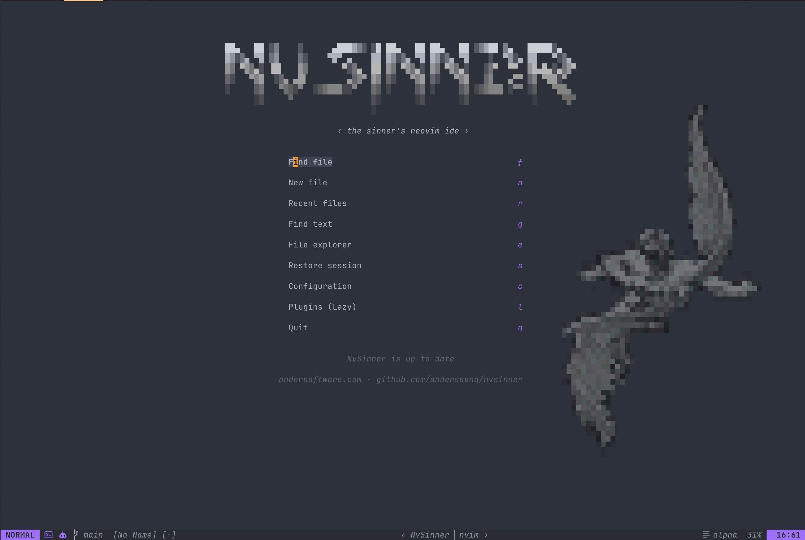

<p align="center">
  
</p>

<p align="center"><i>‹ the sinner's neovim ide ›</i></p>

<p align="center">
  
  
  
  
</p>

<p align="center">
  
</p>

---

## The confession

> *"I got tired of so many IDEs and code editors everywhere — they all end up
> forcing you to use the mouse. On top of that, I started seeing AI tools
> running in the terminal via CLI. That was it for me. Let's put everything
> in the terminal and call it done."*
> — Ander

**NvSinner** is a Neovim distribution that turns your terminal into an AI IDE.
There is no AI plugin inside the editor. Your favorite CLI agent (`claude`,
`opencode`, `kiro-cli`…) lives in a column next to your code, and the editor
watches what it does.

It installs as its own app (`NVIM_APPNAME=nvsinner`), so your existing
`~/.config/nvim` is never touched.

---

## Fall from grace in one line

```bash
curl -fsSL https://raw.githubusercontent.com/anderssonq/nvsinner/main/install.sh | bash
nvsinner
```

Needs **Neovim 0.12+**, `git`, `ripgrep`, Node 20+ and a Nerd Font
(FiraCode Nerd Font ships in `fonts/`). Language servers and formatters install
themselves on first launch. [Full requirements →](docs/installation.md)

---

## The seven sins

Each sin is a feature. Indulge freely.

| | Sin | What it means in NvSinner |
|---|-----|---------------------------|
| 🜂 | **Sloth** | Let the agent work. `Space j` opens an AI column; the first time, it asks which CLI to run. Up to 9 columns (`Space j2`…`Space j9`), each with its own agent. |
| 🜄 | **Greed** | Feed it context without the clipboard. `Space as` sends the selection, `Space ab` an `@`-mention of the file, `Space ad` the line's diagnostics, `Space jx` every file on screen. Nothing is ever auto‑submitted. |
| 🜁 | **Pride** | Ask about your code. Select it, press `Space x` (or triple‑click a word): **Fix · Refactor · Explain · Ask**. |
| 🜃 | **Envy** | Watch every agent at once. `Space xa` opens the cockpit: status (`working` · `idle` · `needs input`) and a live preview of each chat. |
| ☿ | **Gluttony** | Ghost‑text completion on demand. `Ctrl‑l` in insert mode, `Tab` to accept. Served by OpenCode Zen, key read from `$OPENCODE_API_KEY`. |
| ♄ | **Wrath** | Disk wins. When the agent edits a file, the buffer reloads and the changed lines are tinted in your accent color. |
| ♀ | **Lust** | Look good doing it. The native **carbon** theme, 14 palettes, four accents, transparency, and a fallen angel floating behind the dashboard. |

> [!WARNING]
> **Disk wins** means unsaved edits in a buffer the agent rewrites are
> discarded. The editor is a viewer for agent‑authored work.

---

## Your first 60 seconds

| Press | What happens |
|-------|--------------|
| `Space e` | File tree |
| `Space f` | Find files · `Space sf` searches text |
| `Space j` | Open the AI column and pick a CLI |
| select code, `Space x` | Ask AI about it |
| `Space ab` | Mention the current file in the AI input |

Forgot something? `:NvSinnerHelp` lists every command and runs the one you pick.

---

## The four altars

Everything is configured from floating modals, with keyboard or mouse.

| Command | Key | For |
|---------|-----|-----|
| `:NvSinnerMenu` | `Space xm` | Theme, accent, layout, behavior. Saved to `settings/nvsinner-settings.json`. |
| `:NvSinnerIA` | `Space xi` | AI hub: completion on/off, model picker, Ask‑AI, prompts. |
| `:NvSinnerPrompts` | `Space p` | Eleven reusable prompts (PR description, review, tests…). Editable JSON. |
| `:NvSinnerHelp` | `Space xh` | Command palette. |

Try a look for one launch without saving it:

```bash
NVSINNER_THEME=nord NVSINNER_ACCENT=purple nvsinner
```

---

## Penance

| Problem | Do this |
|---------|---------|
| Something feels off | `:checkhealth nvsinner` |
| Update | `:NvSinnerUpdate` |
| Remove it | `~/.config/nvsinner/uninstall.sh` ([other ways](docs/installation.md#uninstalling)) |

**Fast:** ≈ 36 ms headless cold start. **Reproducible:** plugins pinned in
`lazy-lock.json`, tested with `make test`.

---

## Scripture

- [Keybindings](docs/keybindings.md)
- [Settings & theming](docs/settings.md)
- [AI workflow in depth](docs/ai-workflow.md)
- [Architecture](docs/ARCHITECTURE.md)
- [Contributing](docs/CONTRIBUTING.md)

<p align="center">
  <sub><a href="LICENSE">MIT</a> · <a href="https://andersoftware.com">andersoftware.com</a></sub>
</p>
